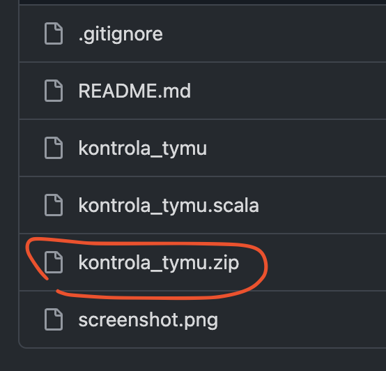
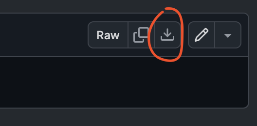

# Hospodský kvíz - Automatická kontrola týmů

Skript po spuštění stáhne týmy z webové rezervace, porovná je se systémem a případně dohledá chybějící týmy v globální databázi Hospodského kvízu.

## Instalace

Stáhni soubor `kontrola_tymu.zip`.

## První spuštění na macOS

Protože aplikace pochází z internetu a není oficiálně podepsaná, systém macOS ji při běžném dvojkliku napoprvé zablokuje s hláškou o neznámém vývojáři. Abys ji mohl spustit, udělej následující:

1. Dvakrát klikni na soubor `kontrola_tymu`.
2. Vyskočí varování, že aplikaci nelze otevřít (nebo že má být přesunuta do koše). Klikni na **Hotovo** (nebo Done).
3. Vlevo nahoře klikni na **ikonu jablíčka** a vyber **Nastavení systému** (System Settings).
4. V levém menu vyber **Soukromí a zabezpečení** (Privacy & Security).
5. Sjeď kousek dolů. Uvidíš tam zprávu, že spuštění souboru "kontrola_tymu" bylo zablokováno. Vedle toho klikni na tlačítko **Přesto otevřít** (Open Anyway).
6. Systém tě požádá o heslo k Macu (nebo Touch ID). Zadej ho.
7. Otevře se černé okno a naposledy se tě zeptá, jestli chceš soubor opravdu otevřít. Klikni na **Otevřít**.

Tímto je aplikace trvale schválená. Při každém dalším spuštění už stačí jen běžný dvojklik.